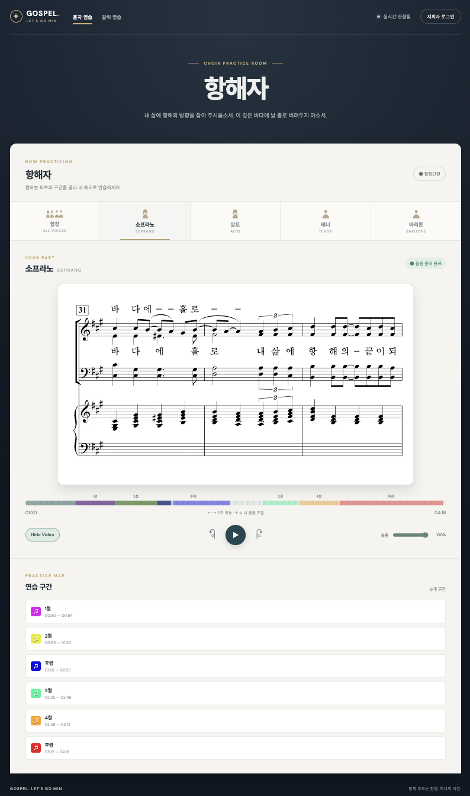
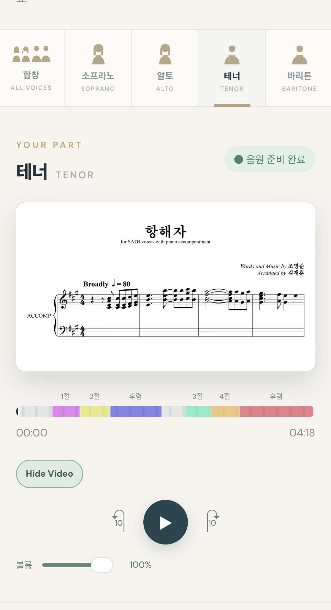
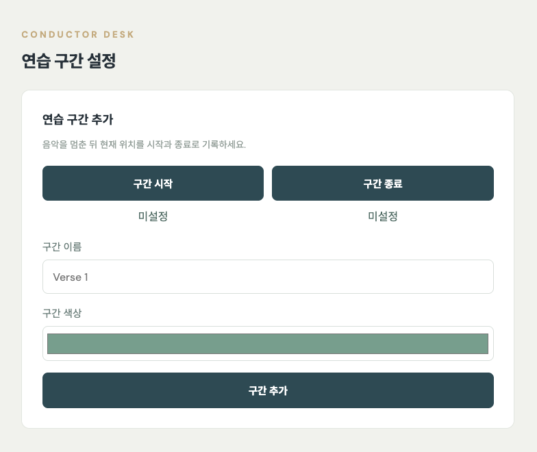
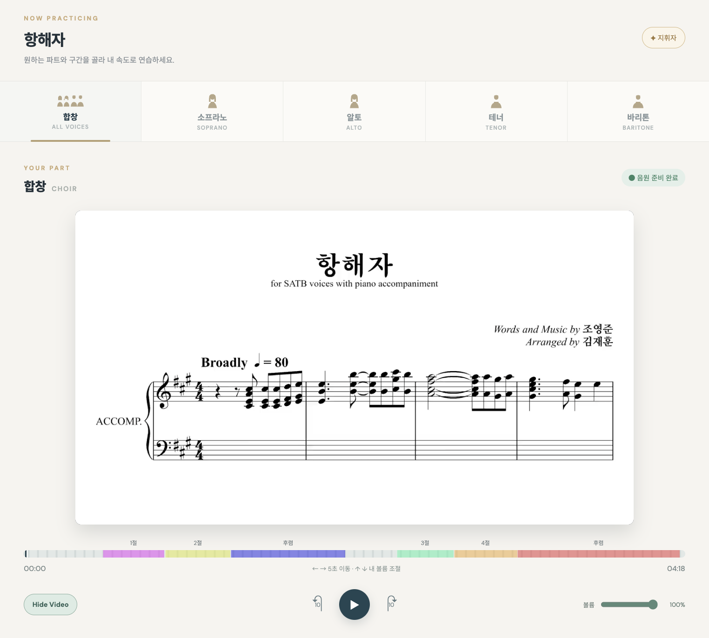

# Gospel Choir Practice · 항해자

성가대원이 자신의 파트를 듣고 지휘자가 표시한 구간을 반복 연습하는 웹 연습실입니다. 합창·소프라노·알토·테너·바리톤 음원 중 하나를 선택할 수 있고, 지휘자는 곡을 들으며 구간의 시작과 끝을 기록할 수 있습니다.

**서비스:** https://gospel.letsgomin.com/

> **같이 연습**은 Web Audio 예약 재생으로 여러 기기의 시작·정지 시각을 맞춥니다. 컴퓨터와 iPhone 내장 스피커 조합은 확인했으며 Bluetooth 출력은 추가 검증 중입니다.

## 주요 기능

| 기능 | 내용 |
| --- | --- |
| 파트별 연습 | 다섯 파트 중 하나를 선택해 자신의 기기에서 재생·일시정지·위치 이동 |
| 같이 연습 | 음원을 미리 디코딩하고 서버가 지정한 공통 시각에 각 기기의 Web Audio 시계로 재생·정지 |
| 연습 구간 | 이름과 색상으로 표시된 구간을 눌러 해당 시작 지점으로 이동 |
| 지휘자 구간 관리 | 음악을 멈춘 위치에서 `구간 시작`·`구간 종료` 기록, 이름·색상 지정, 수정·강조·완료·삭제 |
| 영상 보기 | 영상이 포함된 음원은 기본으로 표시하고 `Hide Video`로 숨기기 |
| 조작 | 재생 버튼 양옆으로 10초 이동, 좌우 방향키로 5초 이동, 상하 방향키로 볼륨 조절 |

## 사용법

### 성가대원

1. [연습실](https://gospel.letsgomin.com/)에 접속해 **합창** 또는 자신의 파트를 선택합니다.
2. **재생 버튼**을 누르면 개인 연습이 시작됩니다. 같은 버튼으로 일시정지하고 다시 재생할 수 있습니다.
3. 재생 막대나 연습 구간 목록을 눌러 원하는 위치로 이동합니다. 구간 목록을 누르면 그 구간의 시작 지점으로 이동합니다.
4. 영상이 있는 음원은 처음부터 악보·영상이 표시됩니다. `Hide Video`로 숨기거나 `Show Video`로 다시 열 수 있으며, 화면을 숨겨도 같은 음원이 이어집니다.

### 지휘자

1. 오른쪽 위 **지휘자 로그인**으로 접속합니다. 배포 사이트에서는 Supabase Authentication에 등록된 이메일과 비밀번호를 사용합니다.
2. 파트를 고르고 음악을 듣다가 **일시정지**합니다. `구간 시작`을 눌러 현재 위치를 기록합니다.
3. 종료할 위치로 이동해 다시 일시정지하고 `구간 종료`를 누릅니다. 이름과 색상을 정한 뒤 **구간 추가**를 누릅니다.
4. 기존 구간의 **수정·강조·완료·삭제** 버튼으로 표시를 관리합니다. 저장한 구간은 성가대원의 개인 연습 화면에도 나타납니다.

입력창을 편집하거나 로그인 창이 열려 있을 때는 방향키 단축키가 적용되지 않습니다. 영상이 없는 음원에서는 `Show Video` 버튼을 사용할 수 없습니다.

## 화면 캡처

캡처를 직접 추가할 수 있도록 [`docs/screenshots`](docs/screenshots/README.md)에 파일 이름과 삽입 방법을 적어 두었습니다. 이미지를 넣기 전에는 깨진 이미지가 표시되지 않습니다.

<!-- 캡처를 추가한 뒤 아래 이미지 줄을 주석 밖으로 옮겨 주세요.




-->

## 로컬 실행

Node.js `20.19` 이상인 20.x 또는 `22.12` 이상과 npm이 필요합니다.

```bash
npm install
npm start
```

`http://localhost:3000`으로 접속합니다. 로컬 Node 서버에서 지휘자로 로그인할 때 아이디는 `conductor`입니다. 프로젝트 루트의 `.env`에 `CONDUCTOR_PASSWORD=원하는_비밀번호`를 지정하거나 서버 실행 시 환경 변수로 전달합니다. 지정하지 않으면 임시 비밀번호가 터미널에 출력됩니다. `.env`와 로컬 구간 데이터인 `data/state.json`은 Git에서 제외됩니다.

```bash
npm test
```

이 테스트는 로컬 Node 서버의 권한, 구간 변경, 분리된 영상·음원 제공, 공동 재생 예약 시각과 시계 변환을 확인합니다.

### 같이 연습 실기기 확인

1. 같은 네트워크에서 `npm start`를 실행하고, 컴퓨터와 iPhone에서 컴퓨터의 LAN 주소(예: `http://192.168.0.10:3000`)로 접속합니다.
2. 두 기기 모두 **같이 연습**과 같은 파트를 고른 뒤 **연습 참여**를 누릅니다.
3. 지휘자 기기에서 재생·일시정지를 여러 번 시험합니다. 재생 버튼은 1.5초 동안 빨강 → 노랑 순서로 준비 신호를 표시하고, 공통 재생 시각과 동시에 초록으로 바뀝니다. 정지 상태에서는 빨강, 재생 중에는 초록을 유지합니다.
4. 주소 끝에 `?syncDebug=1`을 붙이면 서버 기준 위치, 기기 오디오 위치, 시계 보정값과 브라우저가 보고한 출력 지연을 볼 수 있습니다.
5. 내장 스피커로 먼저 확인한 뒤 AirPods 등 무선 출력으로 바꾸고, 화면 잠금·복귀 후에는 필요하면 **연습 참여**를 다시 누릅니다.

## 기술 구성과 배포

| 영역 | 구성 |
| --- | --- |
| 화면·미디어 | Vanilla JavaScript, HTML, CSS, 공통 무음 MP4, 파트별 MP3 |
| 로컬 실행 | Node.js HTTP 서버와 WebSocket |
| 운영 데이터·인증 | Supabase Auth, PostgreSQL, Realtime |
| 정적 배포·도메인 | Vite 빌드, Vercel, Route 53의 서브도메인 |

운영 사이트의 지휘자 권한은 Supabase에 등록한 계정으로 판단합니다. 연습 구간은 데이터베이스에 저장되고, 로그인하지 않은 사용자는 구간을 볼 수만 있습니다. Vercel 환경 변수 설정과 데이터베이스 준비는 [배포 문서](DEPLOY.md)에 정리했습니다.

곡을 바꿀 때는 `public/media/video`에 공통 무음 악보 영상 하나를, `public/media/audio`에 다섯 파트 MP3를 넣고 [`public/tracks.json`](public/tracks.json)의 곡 ID·파일 경로·길이를 수정합니다. 다섯 파트의 `videoFile`은 같은 공통 영상을 가리키고 `audioFile`만 파트별로 달라야 합니다. 모든 MP3와 영상의 시작 지점·길이를 맞춰야 하며, 운영 데이터베이스의 곡 ID와 길이도 함께 맞춰야 합니다.

프로젝트를 진행하며 겪은 문제와 시도는 [개발 경험 정리](EXPERIENCE.md)에, 공동 재생 레이턴시의 원인·BeatSync 참고 내용·해결 구조·진단 순서는 [트러블슈팅 문서](TROUBLESHOOTING.md)에 기록했습니다.
